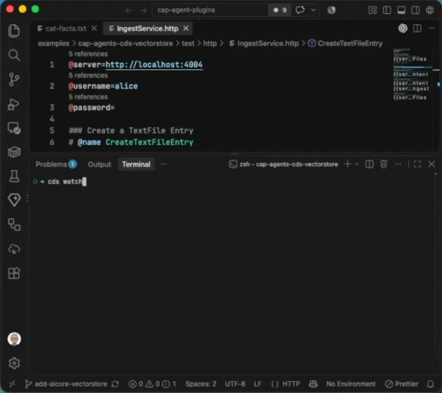

# CDS vector store for CAP agents

This example shows how to give an [`@cap-js/agents`](https://www.npmjs.com/package/@cap-js/agents) agent a knowledge base backed by [`@mi8y/cap-agents-cds-vectorstore`](https://www.npmjs.com/package/@mi8y/cap-agents-cds-vectorstore).

It uploads plain-text files through a CAP media entity, splits them into chunks, creates embeddings with SAP AI Core, and stores the chunks in CAP-managed persistence. The agent searches those chunks before answering questions and cites their source files.



## What you will build

The example adds an ingestion service and a retrieval tool to a standard CAP agent:

| Component               | What it does                                                 |
| ----------------------- | ------------------------------------------------------------ |
| `TextFiles`             | Stores uploaded plain-text files as CAP media.               |
| `TextFiles.ingest`      | Splits a file into chunks and adds them to the vector store. |
| `search_knowledge_base` | Finds chunks relevant to the agent's question.               |

The vector store is named `knowledge-base`. Its name isolates this knowledge base from other vector stores that use the same CAP database.

## Before you start

You need a CAP Node.js project with an agent service and an SAP AI Core configuration for `@cap-js/agents`. This example uses the SAP AI SDK `AzureOpenAiEmbeddingClient` with `text-embedding-3-small`.

The default vector model uses `Vector(1536)`, which matches that embedding model. If you select an embedding model with a different dimension, update the CDS model accordingly.

## Set up a project

1. Copy `.env.example` to `.env` and update the values with your AI Core service credentials.

2. Create a CAP application and add the Node.js runtime if you do not already have one:

```sh
cds init my-knowledge-agent
cd my-knowledge-agent
cds add nodejs
```

3. Install the agent runtime, vector-store plugin, LangChain packages, and SAP AI SDK integration:

```sh
npm install @cap-js/agents @mi8y/cap-agents-cds-vectorstore \
  @sap-ai-sdk/langchain @langchain/core @langchain/textsplitters langchain zod
```

4. Generate the default CDS entities used by the vector store:

```sh
cds add agent-cds-vectorstore
```

This creates `db/agent-cds-vectorstore.cds`, which provides the `Documents` and `DocumentMetadata` entities. Deploy these entities as part of the regular CAP database deployment.

## Create the services

1. Create an agent service:

```cds
/**
 * A generic chatty agent
 */
@agent
service AgentService {}
```

2. Create an ingestion service with a media entity and a bound action:

```cds
service IngestService {
  entity TextFiles : cuid, managed {
    @Core.MediaType: mediaType
    @Core.ContentDisposition.Filename: fileName
    content   : LargeBinary;
    fileName  : String(255);
    mediaType : String(100) default 'text/plain';
  } actions {
    action ingest();
  };
}
```

The complete CDS definitions are in [`srv/agent-service.cds`](srv/agent-service.cds) and [`srv/ingest-service.cds`](srv/ingest-service.cds).

## Ingest text files

The ingestion handler uses `RecursiveCharacterTextSplitter` to divide an uploaded file into overlapping chunks. It creates LangChain `Document` objects with the source filename and chunk number as metadata, then calls `CDSVectorStore.addDocuments`.

CAP media uploads use two requests. First, create a file record:

```sh
curl -X POST http://localhost:4004/odata/v4/ingest/TextFiles \
  -H 'Content-Type: application/json' \
  -d '{"fileName":"cat-facts.txt","mediaType":"text/plain"}'
```

Copy the returned `ID`, then upload the file content:

```sh
curl -X PUT 'http://localhost:4004/odata/v4/ingest/TextFiles(<ID>)/content' \
  -H 'Content-Type: text/plain' \
  --data-binary @files/cat-facts.txt
```

Finally, split the file and add its chunks to the vector store:

```sh
curl -X POST \
  'http://localhost:4004/odata/v4/ingest/TextFiles(<ID>)/IngestService.ingest' \
  -H 'Content-Type: application/json' \
  -d '{}'
```

See the complete handler in [`srv/ingest-service.js`](srv/ingest-service.js).

## Search the knowledge base

`AgentService` adds a `search_knowledge_base` tool with the standard LangChain `similaritySearch` API:

```js
const documents = await vectorStore.similaritySearch(query, limit);
```

The tool returns the relevant chunks and their source metadata. The agent's system prompt instructs it to use this tool for questions and cite the source in its response. The complete implementation is in [`srv/agent-service.js`](srv/agent-service.js).

## Run the example

From this example directory, start CAP in watch mode:

```sh
cds watch
```

Upload a text file as described above, then open [the agent preview](http://localhost:4004/a2a/agent/preview/) and ask a question about it. For example, after uploading `cat-facts.txt`, ask: “What does the knowledge base say about cats?”

## Customize the storage model

`cds add agent-cds-vectorstore` supplies default entities in the `plugin.langchain.vectorstore` namespace. To use separate entities or a different embedding size, define entities using the package's `VectorDocument` and `VectorDocumentMetadata` aspects, then configure `CDSVectorStore` with their fully qualified names.

See the [vector-store plugin documentation](../../packages/cap-agents-cds-vectorstore/README.md#customizing-entities) for custom entities, supported retrieval methods, metadata filtering, and configuration options.
