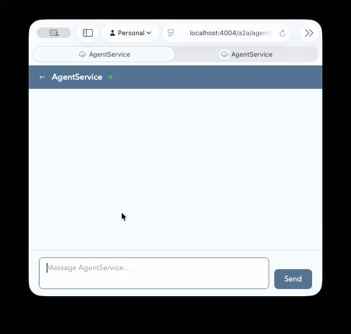

# Long-term memory for CAP agents

This example shows how to give an [`@cap-js/agents`](https://www.npmjs.com/package/@cap-js/agents) agent persistent, cross-session memory with [`@mi8y/cap-agents-memory`](https://www.npmjs.com/package/@mi8y/cap-agents-memory).

The agent can save a user's preferences in CAP-managed persistence and retrieve them later, including from a different agent conversation. The memory stays within the active CAP database and tenant context.



## What you will build

The example adds two tools to a standard CAP agent:

| Tool              | What it does                                    |
| ----------------- | ----------------------------------------------- |
| `save_user_prefs` | Persists a preference for the current CAP user. |
| `get_user_prefs`  | Retrieves that user's saved preference.         |

The store is named `user_preferences_memory`. Its name isolates its data from other stores that use the same database.

## Before you start

You need a CAP Node.js project with an agent service, plus a configured LLM provider for `@cap-js/agents`. This example uses an AI Core configuration; use the provider configuration appropriate for your project.

The memory plugin requires `@sap/cds >= 10` and `@langchain/core >= 1`.

## Set up a project

1. Clone `.env.example` to `.env` and update the values with your AI Core service credentials.

2. Create a CAP application and add the Node.js runtime if you do not already have one:

```sh
cds init my-memory-agent
cd my-memory-agent
cds add nodejs
```

3. Install the agent runtime and memory plugin:

```sh
npm install @cap-js/agents @mi8y/cap-agents-memory
```

4. Generate the default CDS entities used by the memory store:

```sh
cds add agent-memory
```

This creates `db/agent-memory.cds`, which provides `StoreItems` and `StoreItemFields`. Deploy these entities as part of the regular CAP database deployment.

## Create the agent service

1. Create `srv/agent-service.cds`:

```cds
/**
 * A generic chatty agent
 */
@agent
service AgentService {}
```

2. Generate a handler for the service:

```sh
cds add handler
```

## Add persistent memory to the graph

1. In the generated handler, create a `CdsMemoryStore` and pass it to `createAgent` as `store`. Define tools that use `config.store` to save and retrieve facts.

2. The complete implementation is in [`srv/agent-service.js`](srv/agent-service.js). Its essential pieces are:

```js
import { createAgent, tool } from "langchain";
import { CdsMemoryStore } from "@mi8y/cap-agents-memory";

const memory = new CdsMemoryStore({
  name: "user_preferences_memory",
});

const agent = createAgent({
  model,
  tools: [saveUserPreferences, getUserPreferences],
  store: memory,
});
```

3. The example's tools use the current CAP user ID as the item key and `["users", "preferences"]` as the namespace:

```js
await config.store.put(["users", "preferences"], userId, {
  pref: text,
});

const preferences = await config.store.get(["users", "preferences"], userId);
```

`config.store` is supplied by the agent runtime when the tool runs. Use it rather than creating a separate store in every tool, so the tools always operate on the store attached to the graph.

## Run the example

From this example directory, start CAP in watch mode:

```sh
cds watch
```

Open [the agent preview](http://localhost:4004/a2a/agent/preview/) and ask the agent to save a preference, for example: “Remember that I prefer Pizzas.” Start a new conversation and ask for the preference to confirm that it persists across threads.

## How long-term memory differs from conversation state

`CdsMemoryStore` is for durable information that should outlive a single conversation, such as user preferences, profile facts, or learned business context. It is not a replacement for a checkpointer:

| Need                                              | Use                      |
| ------------------------------------------------- | ------------------------ |
| Conversation messages and state within one thread | A LangGraph checkpointer |
| Facts shared between threads and sessions         | `CdsMemoryStore`         |

## Customize the storage model

`cds add agent-memory` supplies a default model. For a custom model, implement the exported `StoreItem` and `StoreItemField` aspects, then configure `CdsMemoryStore` with the fully qualified names of your entities. See the [plugin documentation](../../packages/cap-agents-memory/README.md#custom-entities) for the model and configuration.

To support semantic search, provide a LangChain embeddings implementation and change the generated `Vector(1536)` dimension to match the embedding model. See the [search and filtering documentation](../../packages/cap-agents-memory/README.md#search-and-filtering).
